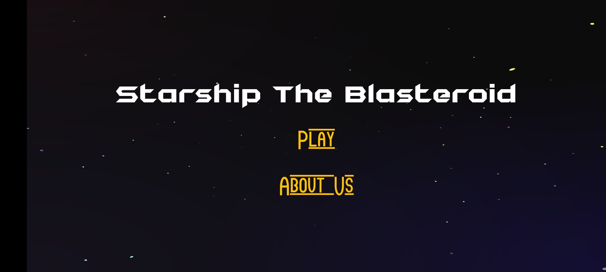
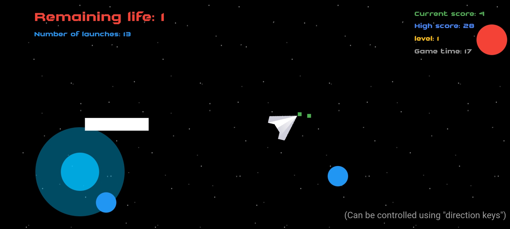
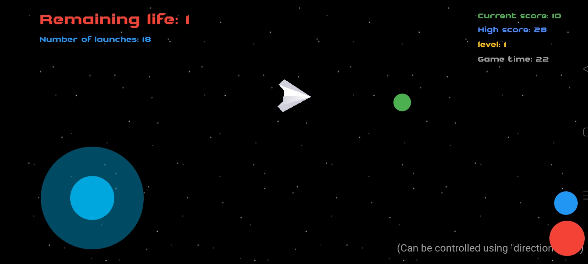
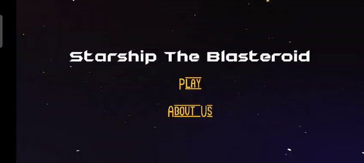
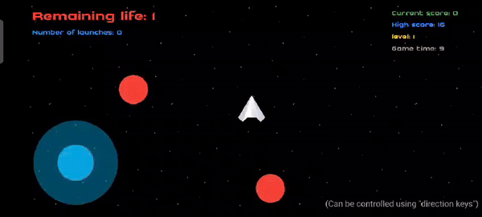
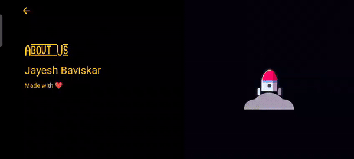

[](starship-the-blasteroid.png)
# Starship: The Blasteroid

Defend the universe by destroying asteroids that are on a crash course for nearby planets! In this space shooter, you won't find any enemy ships.

## Description

Starship: The Blasteroid is an exciting game developed using Flutter. The game's objective is to protect planets from incoming asteroids by controlling a powerful starship.

## Features

- Fast-paced space shooter gameplay
- Stunning graphics and animations
- Simple controls for an immersive gaming experience
- Use of popular libraries like Flame and Flutter

## Libraries Used

- [Flame](https://flame-engine.org/): A minimalist Flutter game engine.
- [Flutter](https://flutter.dev/): UI toolkit for building natively compiled applications for mobile, web, and desktop from a single codebase.

## Screenshots

[](screenshots/image-1.jpeg)


[](screenshots/image-2.jpeg)


[](screenshots/image-3.jpeg)


[](screenshots/part-1.gif)


[](screenshots/part-2.gif)


[](screenshots/part-3.gif)

[/maxresdefault.jpg" width="50%">](https://youtu.be/<VIDEO ID>]

*Caption for the video*

## Getting Started

To run the game locally, follow these steps:

1. **Clone the repository:**

    ```bash
    git clone https://github.com/your-username/starship-the-blasteroid.git
    ```

2. **Navigate to the project folder:**

    ```bash
    cd starship-the-blasteroid
    ```

3. **Install dependencies:**

    ```bash
    flutter pub get
    ```

4. **Run the game:**

    ```bash
    flutter run
    ```

## Download APK

Click the button below to download the latest APK:
[Download APK](./starship-v1.2.apk)

## Contributing

If you'd like to contribute to the development of Starship: The Blasteroid, please follow the guidelines in the [CONTRIBUTING.md](CONTRIBUTING.md) file.

## License

This project is licensed under the MIT License - see the [LICENSE.md](LICENSE.md) file for details.
